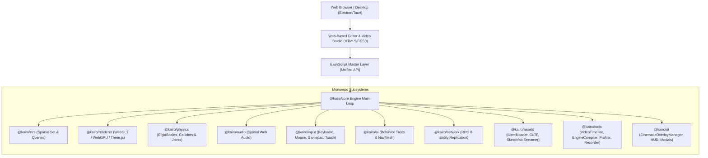

# Kairo Engine - Architecture & Design Specifications

Kairo is a modern, modular, high-performance 2D/3D game engine written primarily in TypeScript. It is designed browser-first with desktop support via Electron/Tauri, featuring an **HTML5 Video Editing Engine**, a unified **EasyScript Master Layer**, an extensible Entity Component System (ECS), WebGL2/WebGPU rendering pipeline, 2D/3D impulse physics engine, spatial Web Audio synthesizer, AI behavior trees & NavMesh pathfinding, and a Web-based Editor UI inspired by Unity, Unreal Engine, and Godot.

---

## 🏗️ High-Level System Architecture

---

## ⚡ Core Principles & Design Patterns

1. **HTML5 Video Editing Engine**:
   Multi-track timeline engine (`VideoTimeline`) supporting keyframed camera shots (`orbit`, `pan`, `dollyZoom`, `crane`), image/video overlays with CSS masking (`circle`, `rounded`, `hexagon`, `vignette`), title cards, video transition cuts (`wipeLeft`, `circleWipe`, `glitch`), color grading presets (`cinematicWarm`, `cyberpunkNeon`, `noir`, `vintage`), and 60 FPS WebM video rendering.

2. **Unified EasyScript Master Layer**:
   Exposes every subsystem capability (Physics, Audio, Particles, AI Pathfinding, Skeletal Animations, IK, Sketchfab streaming, Blender `.blend` parsing, Cinematic Camera Shots, Video Editing, UI Modals, Multiplayer Network Sync) through intuitive single-line commands.

3. **Native Blender `.blend` & Asset Pipeline**:
   Includes `BlendLoader` for binary `.blend` file parsing and live Sketchfab API model streaming.

4. **Ahead-of-Time (AOT) Engine Compiler**:
   Pre-bakes O(1) spatial collision grid hashes, minifies EasyScript ASTs, quantizes geometry buffers, and compiles 1-click standalone HTML5 games.

5. **Modular Gameplay & Systems Engine**:
   - **`InventorySystem` & `InventoryBag`**: Multi-container inventory architecture with automatic item stacking, equipment slots, combined stat bonus aggregation, and save/load serialization.
   - **`StateMachine` (FSM)**: Universal finite state machine for AI, character locomotion, boss phases, lifecycle hooks (`onEnter`, `onUpdate`, `onExit`), conditional triggers, and history rollback.
   - **`ComboDetector`**: High-performance input sequence and timing pattern recognition for fighting combos, double-tap dashes, and cheat codes.
   - **`FloatingTextManager`**: 3D world-to-screen HUD projection pipeline for combat damage numbers, critical strike popups, and billboarded floating health bars.
