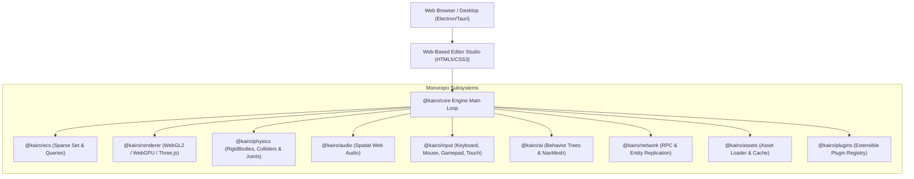

# Kairo Engine - Architecture & Design Specifications

Kairo is a modern, modular, high-performance 2D/3D game engine written primarily in TypeScript. It is designed browser-first with desktop support via Electron/Tauri, featuring an extensible Entity Component System (ECS), WebGL2/WebGPU rendering pipeline, 2D/3D impulse physics engine, spatial Web Audio synthesizer, AI behavior trees & NavMesh pathfinding, and a Web-based Editor UI inspired by Unity, Unreal Engine, and Godot.

---

## 🏗️ High-Level System Architecture



---

## ⚡ Core Principles & Design Patterns

1. **Strict Monorepo & Zero Circular Dependencies**:
   Each subsystem resides in its own package under `packages/` with strict TypeScript typings and clean public interfaces.

2. **Entity Component System (ECS)**:
   Entities are lightweight numeric identifiers. Components are plain data classes. Systems process entities via bitmask queries (`World.query(new Query([Position, Velocity]))`).

3. **Hybrid Render Pipeline**:
   Features a high-performance WebGL2 engine backend with WebGPU readiness. Three.js is leveraged for modern PBR material rendering, directional sun shadows, post-processing, and frustum culling without reinventing low-level WebGL boilerplate.

4. **Zero-Garbage Collection Allocation**:
   Object pooling (`ObjectPool<T>`) is utilized for high-frequency Math vectors, particles, physics contact pairs, and event emissions.

---

## 📂 Monorepo Directory Layout

```
Kairo/
├── packages/
│   ├── core/         # Main Loop, Math, EventSystem, ObjectPool, Time, Scene Graph
│   ├── ecs/          # BitECS / Fast Sparse-Set ECS, Queries, Systems, World
│   ├── renderer/     # PBR Materials, Lighting, Skybox, Particles, Post-Processing
│   ├── physics/      # Rigidbodies, Colliders, Raycasting, PhysicsWorld
│   ├── animation/    # Skeletal Animation, Blend Trees, Two-Bone IK Solver
│   ├── audio/        # Spatial Web Audio Engine & Sound Synthesizer
│   ├── input/        # Action Map Input Manager & Control Rebinding
│   ├── ai/           # NavMesh Grid Pathfinding & Behavior Trees
│   ├── network/      # RPC, Client Prediction & State Replication
│   ├── assets/       # Async Asset Loader & Hot-Reload Cache
│   └── plugins/      # Plugin System Registry & Lifecycle Hooks
├── editor/           # Web-Based Game Editor Studio UI (HTML/CSS/JS)
├── examples/         # Standalone Playable Showcase Demos
├── tests/            # Automated Unit & Performance Benchmarks
├── docs/             # Architecture, API Reference, & Plugin Guides
└── .github/workflows/ # GitHub Actions CI/CD Pipeline
```
